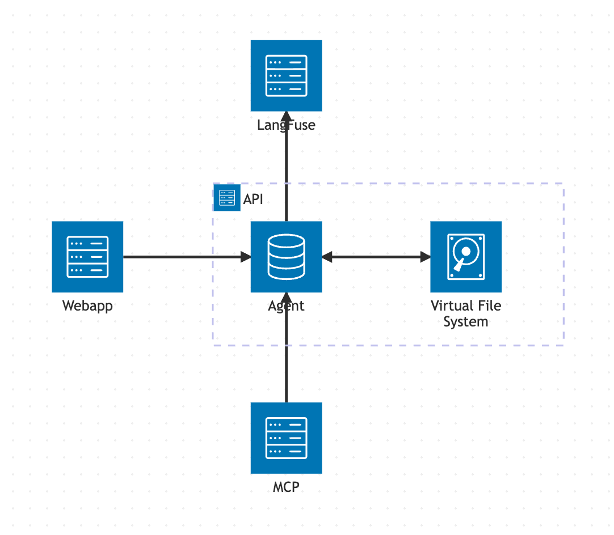
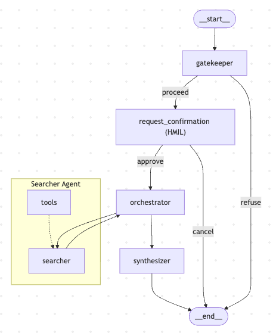

# The Deep Researcher

A practical implementation of a Deep Researcher agent built with LangGraph, LangChain, and modern LLMs. The project demonstrates how multiple specialized agents collaborate to orchestrator, researcher, and synthesizer comprehensive answers.

## High-level Architecture



## Agent workflow



## Techstack:

### AI Models
- OpenAI: gpt-5.1
- Google: Gemini 3.1 Flash Lite

### Frameworks & Libraries
- Python v3.14
- LangChain v1.3.9
- LangGraph v1.2.5
- FastAPI
- CopilotKit
- LangFuse

## Dependencies

This project uses a [VSCode Devcontainer](https://code.visualstudio.com/docs/devcontainers/containers) for a consistent development environment.

- **Docker**
- **Visual Studio Code**

## Setup and Installation

### 1. Clone the Repository

```bash
git clone git@gitlab.asoft-python.com:hien.nguyenvan/ai-training.git
cd ai-training/deep_researcher_agent
```

### 2. Launch the Code Editor

- Ensure Docker is running.
- Open the project folder (`deep_researcher_agent`) in Visual Studio Code.
- Reopen the project in the Dev Container
- VSCode will automatically create a dev container in Docker.

### 3. Running the Application

#### Install Dependencies

> Skip this step if you're using the Dev Container.

Install the project dependencies with **uv**.

```bash
uv sync
```

If you don't have `uv` installed, follow the installation guide:

https://docs.astral.sh/uv/

#### Set Up Environment Variables

Copy the sample environment file:

```bash
cp .env.sample .env
cp mcp/.env.sample mcp/.env
```

Replace placeholder values with your actual environment variables (e.g., `OPENAI_API_KEY`, ...).

#### Start the MCP Server

```bash
cd mcp
uv run main.py
```

#### Start the OPA Server

Mkae sure you have install OPA. Reference [the document](https://www.openpolicyagent.org/docs?current-os=linux#install-and-run-opa)

```bash
./opa run --server --addr :8181 ./policies/search_platform.rego
```

#### Start the FastAPI Server

```bash
uv run fastapi dev
```

The backend will be available at:

* **Base URL:** `http://localhost:8000`
* **Chat API:** `http://localhost:8000/api/v1/chatbot/chat`
* **Streaming Chat API:** `http://localhost:8000/api/v1/chatbot/chat/stream`
* **CopilotKit Deep Researcher API:** `http://localhost:8000/copilotkit/deep_researcher/`

> The CopilotKit endpoint can be integrated with CopilotKit using LangGraphHttpAgent. See the CopilotKit LangGraph FastAPI Quickstart for setup instructions: https://docs.copilotkit.ai/langgraph-fastapi/quickstart?agent=bring-your-own

#### Running the Web Application

```bash
cd webapp
npm install
npm run dev
```

The web application will start in development mode and connect to the backend running on `http://localhost:8080`.